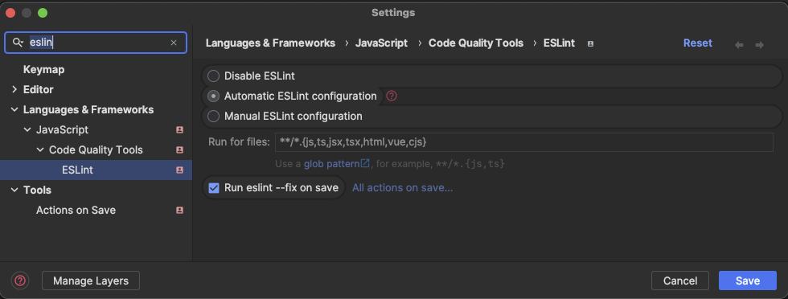

<a id="readme-top"></a>

# Development

- [Development](#development)
  - [Documentation](#documentation)
  - [Commands](#commands)
    - [Root commands](#root-commands)
    - [Server build - CI/CD](#server-build---cicd)
  - [Commits](#commits)
  - [Environment variables](#environment-variables)
    - [NODE\_ENV \& VITE MODE](#node_env--vite-mode)
    - [Code usage](#code-usage)
    - [VITE\_APP\_\*](#vite_app_)
  - [Dependencies management](#dependencies-management)
    - [Add new dependencies](#add-new-dependencies)
    - [Update dependencies](#update-dependencies)
  - [Libraries](#libraries)
    - [Add a new library](#add-a-new-library)
      - [Adding library types to the app](#adding-library-types-to-the-app)
    - [Connect library to an app](#connect-library-to-an-app)
  - [Linting, formatting and types](#linting-formatting-and-types)
    - [ESLint](#eslint)
      - [ESLint in Visual Studio Code](#eslint-in-visual-studio-code)
      - [ESLint in Rider / other JetBrains IDEs](#eslint-in-rider--other-jetbrains-ides)
    - [Tailwind](#tailwind)
      - [Tailwind in Visual Studio Code](#tailwind-in-visual-studio-code)
      - [Tailwind in Rider / other JetBrains IDEs](#tailwind-in-rider--other-jetbrains-ides)
    - [Typescript](#typescript)
      - [Missing types from libraries](#missing-types-from-libraries)
      - [Setting up the typescript configuration](#setting-up-the-typescript-configuration)

## Documentation

- [Nx Documentation](https://nx.dev/getting-started/intro)
- [Vite Documentation](https://vite.dev/guide/)
- [Husky Documentation](https://typicode.github.io/husky/)
- [commitlint Documentation](https://commitlint.js.org/#/)
- [Conventional Commits](https://www.conventionalcommits.org/en/v1.0.0/)

<p align="right">(<a href="#readme-top">back to top</a>)</p>

## Commands

To start the development server, build or see the build preview of a specific app  
go to this project directory and look for a `README.md` for more information.

All projects are located in the `/apps` directory and libraries in the `/libs` directory.

### Root commands

```sh
# Install dependencies
pnpm run init

# Install dependencies for CI
pnpm run ci

# Build projects for production - outputs are saved in the `/dist` directory
pnpm run build:prod

# Build projects for staging - outputs are saved in the `/dist` directory
pnpm run build:staging

# Clean dependencies
pnpm run clean
```

<p align="right">(<a href="#readme-top">back to top</a>)</p>

### Server build - CI/CD

Locally for testing purposes all of the projects will be built, thanks to the `run-many` command.  

In a CI/CD pipeline Nx should only build the affected projects (only projects containing changes).  
For this purpose, the `affected` command should be configured.

```bash
pnpm nx affected -t build:prod
# or
pnpm nx affected -t build:staging
```

By default the command checks if a package/project is affected by comparing the HEAD of the current branch  
with the main branch. Check the [official documentation](https://nx.dev/ci/features/affected#specify-which-shas-to-use-to-calculate-affected-code) for more options.

<p align="right">(<a href="#readme-top">back to top</a>)</p>

## Commits

Thanks to the `commitlint` and `husky` packages, the commit messages are being checked before the commit.  
This ensures that the messages are in a standardized format.

```bash
# type: feat, fix, docs, ...
# scope: the part of the project you are working on (optional)
# subject: short description of the changes
git commit -m "<type>(<scope>): <subject>"
```

Read more about the [Conventional Commits](https://github.com/conventional-changelog/commitlint)

<p align="right">(<a href="#readme-top">back to top</a>)</p>

## Environment variables

### NODE_ENV & VITE MODE

The NODE_ENV=production is not supported by Vite.  
Only the NODE_ENV=development is being respected to create a development build of the project  
Vite has also so called Mode, depending on the .env file used for build or a serve command.  

Respectively it uses

- `.env.development` file for development mode (local; serve command)
- `.env.production` file for production mode (build command)
- `.env.[mode]` file for custom mode (build command with --mode [mode] argument)

More about modes [here](https://vitejs.dev/guide/env-and-mode.html#modes)  

> [!CAUTION]  
> If you need some local environment variables in apps or libs you theoretically could use simple `.env` file,  
> but in combination with Nx it causes a known issue. Nx will use the `.env` file for every build mode,  
> effectively ignoring the `.env.production` and other `.env.[mode]` files.
> Therefore, if you need some local environment variables, use `.env.development` or `.env.development.local` file.

<p align="right">(<a href="#readme-top">back to top</a>)</p>

### Code usage

To make use of environment variables in your code, you can simply use `import.meta.env.MODE` variable.

```javascript
if (import.meta.env.MODE !== 'production') {
  console.log('Not the production mode');
}
```

<p align="right">(<a href="#readme-top">back to top</a>)</p>

### VITE_APP_*

Use `VITE_APP_` prefix to expose environment variables to your app  

```bash
VITE_APP_API_URL=https://api.example.com
```

> [!CAUTION]  
> Such variables are exposed to the client-side code and can be seen in the browser's developer tools.  
> Do not expose any sensitive data in this way (secret api keys, etc.).

<p align="right">(<a href="#readme-top">back to top</a>)</p>

## Dependencies management

### Add new dependencies

Go to the root directory and run the following command.

```bash
# for dependencies 
pnpm add <package-name> -w

# for devDependencies
pnpm add <package-name> -Dw
```

If a specific package is required **only for one** specific project, then go to the directory of this project  
and run the same command without the `-w` flag.

```bash
# for dependencies
pnpm add <package-name>

# for devDependencies
pnpm add <package-name> -D
```

<p align="right">(<a href="#readme-top">back to top</a>)</p>

### Update dependencies

```bash
pnpm update --latest
```

<p align="right">(<a href="#readme-top">back to top</a>)</p>

## Libraries

### Add a new library

Libraries in the monorepo are located in the `/libs` directory.  
In our case they are not meant to be build separately, but to be used in the projects directly and bundled with them.  

To add a new library:

1. go to the directory - `/libs` and add a new directory with the library name
2. copy and paste the following files from an existing library:
    - `package.json`
    - `tsconfig.json`
    - `.eslint.json`
    - `README.md`
    - src/`index.ts`
    - src/`vue-shim.d.ts` (if the library is for Vue.js)
3. finally modify the `package.json` file with
    - the new unique library name
    - as well as planned exports if they should be any different,
    - add dependencies & devDependencies  
      (only if they are unique for this library; otherwise they should be added to the root `package.json` file -> [Dependencies management](#dependencies-management))  

A standard `package.json` file for a library looks like this:

<details><summary>Sample 'package.json'</summary>
  
```json
{
    "name": "@monorepo/<library-name>",
    "version": "1.0.0",
    "private": true,
    "type": "module",
    "exports": {
        ".": "./src/index.ts",
        "./composables/*": "./src/composables/*",
        "./lib/*": "./src/lib/"
    },
    "nx": {
        "projectType": "library"
    },
    "scripts": {
        "lint": "eslint --ext .js,.jsx,.ts,.tsx,.vue src",
        "lint:fix": "eslint --ext .js,.jsx,.ts,.tsx,.vue --fix src"
    },
    "dependencies": {}
}
```

</details>
<br>

> [!NOTE]
> If you just added a new app or library, it is possible that nx has to be restarted to recognize the new project.  
> If `Nx Console` plugin is installed in your IDE, most probably all will be recognized automatically.  
> Otherwise, you can run the following command from the root directory.

```bash
npx nx watch --all -- echo \$NX_PROJECT_NAME
```

<p align="right">(<a href="#readme-top">back to top</a>)</p>

#### Adding library types to the app

Be aware that if you define the `exports` field in the `package.json` file, most probably you will  
have to add in your app project a clear definition of those paths in the `tsconfig.json` file.

```json
{
    "compilerOptions": {
        "paths": {
            "@monorepo/<library-name>": [
                "libs/<library-name>/src/index.ts"
            ],
            "@monorepo/<library-name>/composables/*": [
                "libs/<library-name>/src/composables/*"
            ],
            "@monorepo/<library-name>/lib/*": [
                "libs/<library-name>/src/lib/*"
            ]
        }
    }
}
```

<p align="right">(<a href="#readme-top">back to top</a>)</p>

### Connect library to an app

To use an existing or newly created library in an app, follow these steps:

1. Add it to the `package.json` file of the app without the version number.  
By doing so you will always get the latest version of the library.

    ```json
    {
        "dependencies": {
            "@monorepo/<library-name>": "*"
        }
    }
    ```

2. Modify the `tsconfig.json` file in the app directory to include the library in the `compilerOptions.paths` object.

    ```json
    {
        "compilerOptions": {
            "paths": {
                "@monorepo/<library-name>": [
                    "libs/<library-name>/src/index.ts"
                ]
            }
        }
    }
    ```

3. Run the following command from the root directory - `/`

    ```bash
    pnpm run init
    ```

4. Finally you can import the library functions / components in your app

    ```typescript
    import { <library-name> } from '@monorepo/<library-name>';
    ```

<p align="right">(<a href="#readme-top">back to top</a>)</p>

## Linting, formatting and types

### ESLint

The ESLint configuration is located in the `.eslintrc.cjs` file in the root directory  
and is imported and extended in the apps if needed.

There is no Prettier in this template for a good reason. Having yet another tool to format the code and solving  
the conflicts between Prettier and ESLint can be avoided thanks to the Anthony Fu's  `@stylistic/eslint-plugin` package.  
Now ESLint can do the same and at the same time warn us about the code quality.

[More on this subject](https://medium.com/@jolodev/my-thoughts-on-eslint-dropping-formatting-rules-2bc452bee5e2)  
[ESLint Stylistic](https://eslint.style/)

**RECOMMENDED**  
Add in your IDE the ESLint extension and activate formatting on save.  

#### ESLint in Visual Studio Code

<details><summary>Visual Studio Code settings</summary>

To use the ESLint extension in Visual Studio Code, install the `dbaeumer.vscode-eslint` extension.  
Add the following settings to the `settings.json` file in Visual Studio Code for the best experience.  

You can open the `settings.json` by going to `File -> Preferences -> Settings`  
and pressing on the `{}` icon in the top right corner.

🟦 **Note**  
> If you use the default `.code-workspace` file from the root directory, you don't need to add these settings.  
> They are already there.

```json
{
    "[html]": {
        "editor.defaultFormatter": "dbaeumer.vscode-eslint"
    },
    "[javascript]": {
        "editor.defaultFormatter": "dbaeumer.vscode-eslint"
    },
    "[typescript]": {
        "editor.defaultFormatter": "dbaeumer.vscode-eslint"
    },
    "[vue]": {
        "editor.defaultFormatter": "dbaeumer.vscode-eslint"
    },
    "editor.codeActionsOnSave": {
        "source.fixAll.eslint": "explicit"
    },
    "eslint.format.enable": true,
    "eslint.options": {
        "extensions": [
            ".html",
            ".js",
            ".cjs",
            ".vue",
            ".jsx"
        ]
    },
    "eslint.validate": [
        "html",
        "vue",
        "language",
        "javascriptreact",
        "typescript",
        "javascript"
    ],
}
```

</details>

#### ESLint in Rider / other JetBrains IDEs

<details><summary>Rider settings</summary>
  
To use the ESLint extension in Rider, you need to open settings and search for ESLint and set the following settings:

- [x] Automatic ESLint configuration  
- Run for files: `**/*.{js,ts,jsx,tsx,html,vue,cjs}`  
- [x] Run eslint --fix on save



🟦 **Note**  
> If you are on a Mac you can open two windows of Rider in the same application.  
> Just open the second Project in the second window and choose the `Window -> Merge All Project Windows` option.  
> More on this subject [here](https://www.jetbrains.com/help/rider/Open_projects_and_solutions.html#switch_solutions)

</details>

<p align="right">(<a href="#readme-top">back to top</a>)</p>

### Tailwind

To work with a projects utilizing Tailwind CSS, you should **(strongly recommended)** install the Tailwind CSS IntelliSense extension.  
You will find one in the marketplace for Visual Studio Code as well as for Rider.

The extension will provide you with the IntelliSense for the Tailwind CSS classes, but not everywhere you could need it.  
That's why we developed additional configuration.

#### Tailwind in Visual Studio Code

<details><summary>Visual Studio Code settings</summary>

To use the Tailwind extension in Visual Studio Code, install the `bradlc.vscode-tailwindcss` extension.  
Add the following settings to the `settings.json` file in Visual Studio Code for the best experience.  

You can open the `settings.json` by going to `File -> Preferences -> Settings`  
and pressing on the `{}` icon in the top right corner.

🟦 **Note**  
> If you use the default `.code-workspace` file from the root directory, you don't need to add these settings.  
> They are already there.

```jsonc
{
    "tailwindCSS.experimental.classRegex": [
        // for VuePrime styling. Example: class: [strings_in_this_array]
        [
            "class:\\s*\\[((?:[^[\\]]|\\[(?:[^[\\]]|\\[[^[\\]]*\\])*])*?)\\]",
            "(?:['\"`]([^'\"`]*)['\"`])"
        ],
        // for computed functions. Example: const textClass = computed(() => ['text-red'])
        [
            "computed\\(\\s*\\(\\s*\\)\\s*=>\\s*([\\s\\S]*?)\\)",
            "(?:['\"`]([^'\"`]*)['\"`])"
        ],
        // additional inline option - add /*tw:*/ before any string
        "\\/\\*\\s?tw:\\s?\\*\\/\\s?['\"`](.*)['\"`]"
    ],
}
```

</details>

#### Tailwind in Rider / other JetBrains IDEs

<details><summary>Rider settings</summary>

Install the `Tailwind CSS` plugin from the JetBrains marketplace.  
Then go to the `File -> Settings -> Languages & Frameworks -> Style Sheets -> Tailwind CSS`  
and ad this configuration to the `experimental > classRegex` field.

```json
{
    "experimental": {
        "classRegex": [
            [
                "class:\\s*\\[((?:[^[\\]]|\\[(?:[^[\\]]|\\[[^[\\]]*\\])*])*?)\\]",
                "(?:['\"`]([^'\"`]*)['\"`])"
            ],
            [
                "computed\\(\\s*\\(\\s*\\)\\s*=>\\s*([\\s\\S]*?)\\)",
                "(?:['\"`]([^'\"`]*)['\"`])"
            ],
            "\\/\\*\\s?tw:\\s?\\*\\/\\s?['\"`](.*)['\"`]"
        ]
    }
}
```

</details>

<p align="right">(<a href="#readme-top">back to top</a>)</p>

### Typescript

The typescript configuration is located in the `tsconfig.base.json` file in the root directory.  
All projects (app and libs) are extending this configuration.

#### Missing types from libraries

If it's your case - check if the library index file or one of the shortcuts to library directories is not missing  
in the in the app in `tsconfig.json` file. More on this -> [Adding library types to the app](#adding-library-types-to-the-app).

#### Setting up the typescript configuration

Keep in mind that referencing the `tsconfig.json` file in a project and changing any of the settings  
will not merge everything with the `tsconfig.base.json` file but partially override it.  
[More on this subject](https://miyoon.medium.com/array-parameters-in-tsconfig-json-are-always-overwritten-11c80bb514e1)

To see the typescript configuration, you can run the following command from the directory  
in which you want to see the local one - a merge/overwrite of the base and the extending one.  

```bash
npx tsc --showconfig
```

<p align="right">(<a href="#readme-top">back to top</a>)</p>
